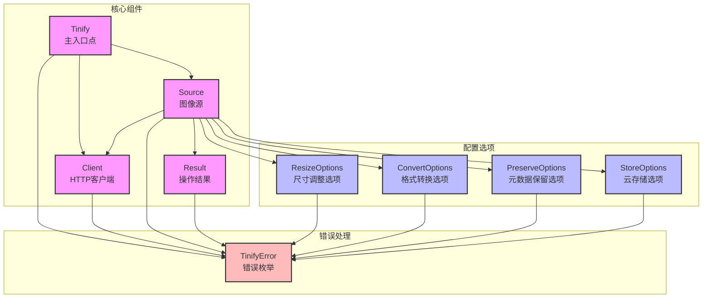

# 绘制tinify-rs组件关系图
_Exported on 2025/6/17 at GMT+8 7:05:34 from Cursor (1.1.3)_

---

**User**

@/tinify-rs 可以基于rust实现源码和md设计稿，画出整个组件间关系么

---

**Cursor**

我将基于设计文档为您绘制tinify-rs的组件关系图。我会使用Mermaid图表来展示组件之间的关系。



让我为您解释这个组件关系图：

1. **核心组件**：
   - `Tinify`：作为库的主入口点，负责管理全局配置和创建`Source`实例
   - `Client`：处理所有HTTP通信，包括认证和请求发送
   - `Source`：代表一个图像源，封装了API返回的Location URL
   - `Result`：表示API操作的结果，包含处理后的图像数据和元数据

2. **配置选项**：
   - `ResizeOptions`：用于配置图像尺寸调整的参数
   - `ConvertOptions`：用于配置图像格式转换的参数
   - `PreserveOptions`：用于配置元数据保留的参数
   - `StoreOptions`：用于配置云存储的参数

3. **错误处理**：
   - `TinifyError`：统一的错误类型，包含所有可能的错误变体

主要关系说明：

1. `Tinify` 是顶层组件，它：
   - 管理 `Client` 实例
   - 创建 `Source` 实例
   - 处理全局配置

2. `Source` 是核心操作组件，它：
   - 使用 `Client` 发送请求
   - 返回 `Result` 对象
   - 接受各种配置选项（ResizeOptions、ConvertOptions等）

3. 所有组件都可能产生错误，这些错误都被统一封装在 `TinifyError` 中

4. 配置选项类都实现了构建器模式，用于创建相应的配置对象

这个架构设计遵循了Rust的惯用模式，同时保持了与tinify-java的功能对等性。它充分利用了Rust的类型系统和所有权机制，确保了内存安全和线程安全。

您是否需要我详细解释某个特定组件的关系或实现细节？

```plaintext
graph TB
    subgraph 核心组件
        Tinify[Tinify<br/>主入口点]
        Client[Client<br/>HTTP客户端]
        Source[Source<br/>图像源]
        Result[Result<br/>操作结果]
    end

    subgraph 配置选项
        ResizeOptions[ResizeOptions<br/>尺寸调整选项]
        ConvertOptions[ConvertOptions<br/>格式转换选项]
        PreserveOptions[PreserveOptions<br/>元数据保留选项]
        StoreOptions[StoreOptions<br/>云存储选项]
    end

    subgraph 错误处理
        TinifyError[TinifyError<br/>错误枚举]
    end

    %% 核心组件关系
    Tinify --> Client
    Tinify --> Source
    Source --> Client
    Source --> Result
    Source --> ResizeOptions
    Source --> ConvertOptions
    Source --> PreserveOptions
    Source --> StoreOptions

    %% 错误处理关系
    Tinify --> TinifyError
    Client --> TinifyError
    Source --> TinifyError
    Result --> TinifyError

    %% 配置选项关系
    ResizeOptions --> TinifyError
    ConvertOptions --> TinifyError
    PreserveOptions --> TinifyError
    StoreOptions --> TinifyError

    %% 样式
    classDef core fill:#f9f,stroke:#333,stroke-width:2px
    classDef options fill:#bbf,stroke:#333,stroke-width:2px
    classDef error fill:#fbb,stroke:#333,stroke-width:2px

    class Tinify,Client,Source,Result core
    class ResizeOptions,ConvertOptions,PreserveOptions,StoreOptions options
    class TinifyError error
```
